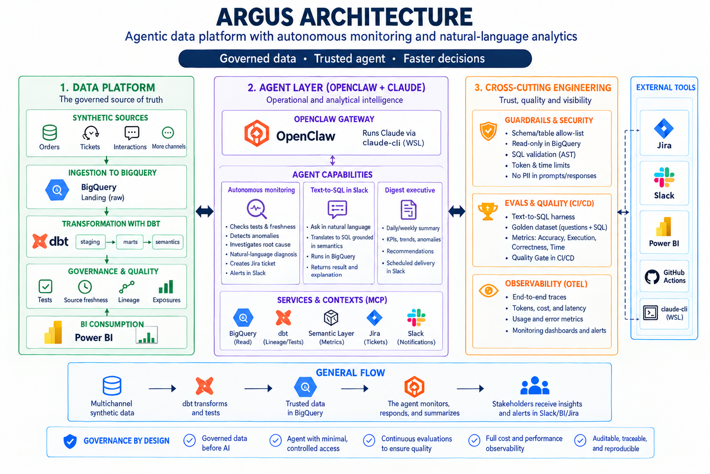

<div align="center">

# 🛰️ Argus — Autonomous Data Reliability & Analytics Agent

### An agentic data platform that monitors pipelines, self-diagnoses incidents, and answers business questions in natural language — built on dbt, BigQuery, OpenClaw, and Claude.

<br>


<br>

> **Proof of Concept** — Argus simulates the data reliability stack a data-driven company needs in order to move from *reactive* firefighting ("why did this dashboard number change?") to *proactive*, self-diagnosing pipelines, plus a governed natural-language analytics layer. Everything runs on synthetic data; no real company information is used.

<br>

[🎯 Problem](#-the-problem) · [💡 Solution](#-the-solution) · [📐 Architecture](#-architecture) · [🧱 Data Platform](#-data-platform-dbt--bigquery) · [🧮 Semantic Layer](#-semantic-layer) · [🛡️ Guardrails](#️-guardrails--security) · [🤖 Text-to-SQL](#-text-to-sql) · [🚨 Monitoring](#-autonomous-monitoring-capability-1) · [📊 Digest](#-executive-digest-capability-3) · [🔮 Predictive Radar](#-predictive-radar-capability-4) · [🔌 OpenClaw](#-orchestration-openclaw--slack--jira) · [🧪 Evals](#-evaluation-harness) · [🏢 Per-Client Config](#-per-client-configuration) · [🚀 Quick Start](#-quick-start) · [🩺 Design Decisions](#-design-decisions--tradeoffs) · [📁 Structure](#-project-structure)

</div>

---

## 🎯 The Problem

Every company that runs on data hits the same two failure modes as it scales:

| Symptom | Real-world impact |
|---|---|
| Pipelines break **silently** | A KPI shifts and nobody knows why until a stakeholder complains |
| Root-cause analysis is **manual** | On-call analysts burn hours writing ad-hoc queries |
| Quality checks live **inside a script** | No lineage, no history, no gate — bad data lands in the warehouse |
| Analysts are a **bottleneck** for questions | "Why did sales drop last week?" waits in a queue |
| LLM-over-SQL demos **hallucinate joins** | Impressive in the demo, broken in production |

---

## 💡 The Solution

A governed data platform with an agent on top that reads the *governed* layer — never raw tables:

```
Multi-channel synthetic data  →  dbt (staging → marts + tests)  →  BigQuery
                                          │
                                 Semantic layer (governed metrics)
                                          │
                                  Claude (Sonnet 5, via API)
                                          │
                        ┌─────────────────┴─────────────────┐
                  Text-to-SQL in CLI                   Eval harness
              (anchored to the semantic layer)     (execution accuracy)
```

1. **Model** the warehouse with dbt — staging, marts, tests, and freshness as first-class citizens.
2. **Govern** metrics in a semantic layer validated against the models' real SQL — not a hand-maintained column list that silently goes stale.
3. **Fence** any generated SQL with guardrails before it touches BigQuery: read-only, no PII, no stacked SQL, row-capped.
4. **Answer** business questions via text-to-SQL, anchored to the semantic layer.
5. **Measure** text-to-SQL accuracy with an eval harness that compares result sets, not text.
6. **Configure per client** in a single YAML — the code doesn't change between clients with a similar stack.

---

## 📐 Architecture


<sub>*(replace `Img_Arq.png` with your own diagram before publishing — no real image was generated during the build; the text diagram below is the current source of truth)*</sub>

Three layers, each with a single responsibility:

**Data platform (the source of truth).** A synthetic generator parameterized per client (`clients/*.yml`) writes multi-channel events to BigQuery. dbt transforms `raw → staging → marts`, with data tests and declared freshness. This layer is deterministic and fully testable — the agent never invents data, it reads modeled tables.

**Agent layer (Claude via the Anthropic API).** `argus/ask.py` takes a question, anchors it to the semantic layer, generates SQL, validates it with guardrails, executes it with a read-only service account, and returns a narrative.

**Cross-cutting engineering.** Guardrails, an eval harness acting as a CI gate, and a per-client configuration layer wrap both layers.

> **Status:** all four capabilities (the three from the original design, plus the Predictive Radar added later) are implemented and verified against real data and credentials — not just on paper. Orchestration too: five skills run on their own via OpenClaw + cron, and incidents genuinely reach Slack and open Jira tickets.

---

## 🧱 Data Platform (dbt + BigQuery)

The warehouse is modeled, not dumped:

```
models/
├── staging/      one model per source (stg_orders_web/app/pos), 1:1 with raw
├── intermediate/ union of the 3 channels, ephemeral (no physical table)
└── marts/        mart_orders — one row per order, documented, tested
```

Everything lives in the `argus_analytics` dataset regardless of layer — a macro (`macros/generate_schema_name.sql`) enforces that, because dbt's default behavior (`+schema: staging` → a new `analytics_staging` dataset) would have broken the permission model: the agent's read-only account only has access to `argus_analytics`, not to datasets dbt might invent.

```yaml
# models/staging/_staging.yml
sources:
  - name: raw
    freshness:
      warn_after:  { count: 6,  period: hour }
      error_after: { count: 12, period: hour }
    loaded_at_field: _ingested_at
    tables:
      - name: raw_orders_web
      - name: raw_orders_app
      - name: raw_orders_pos
```

`dbt build` runs models and tests in dependency order. Real tests, not filler: `revenue >= 0`, `ingestion_lag_minutes >= 0`, unique `order_id`, `channel`/`status` constrained to valid values.

---

## 🧮 Semantic Layer

`semantic/metrics.yml` defines `orders`, `revenue`, and `cancellation_rate` — once. The agent receives these definitions as anchoring context and composes SQL from known metrics, not from invented column arithmetic.

```yaml
metrics:
  - name: cancellation_rate
    calculation: "countif(status = 'cancelled') / count(order_id)"
    table: "mart_orders"
    grain: ["order_date", "channel", "country"]
```

**The validation is not cosmetic.** `argus/semantic.py` parses the *actual* SQL of `mart_orders.sql` with `sqlglot` and confirms that every metric and every `grain` dimension references columns that really exist — not a hand-maintained column list that silently goes stale. The first version of this validator had a real bug: it read the model's closing `select * from final` and kept the literal `*` instead of resolving the columns of the `final` CTE. It was caught by deliberately breaking the mart before shipping the code — see [Design Decisions](#-design-decisions--tradeoffs).

---

## 🛡️ Guardrails & Security

The agent talks to BigQuery through a **read-only** service account (`sa-agent`), separate from the one that loads data (`sa-loader`) since Phase 0. Every generated query is validated *before* it runs:

```python
# argus/guardrails/sql.py
BLOCKED_STATEMENT_TYPES = (exp.Insert, exp.Update, exp.Delete, exp.Drop, exp.Create, exp.Alter, exp.Merge)

def validate(sql: str, max_rows: int = 10_000, ...) -> str:
    statements = [s for s in sqlglot.parse(sql, read="bigquery") if s is not None]
    if len(statements) > 1:
        raise GuardrailViolation("Stacked SQL is not allowed.")   # see note below
    ...
```

Defense in depth:

- **Read-only IAM** — the primary control. `sa-agent` *cannot* write, no matter what SQL it generates.
- **`SELECT` only, no `SELECT *`** — columns named explicitly.
- **Stacked-SQL rejection** — `sqlglot.parse_one()` silently discards anything after a `;`; an attack like `SELECT ...; DROP TABLE ...;` would look "clean" if you only inspected the first statement. This project uses `sqlglot.parse()` (plural) and requires exactly one statement. Found by testing adversarial cases before writing the tests, not after an incident.
- **Blocked PII columns** — an explicit list, English + Spanish, exact match on the normalized name (not fuzzy heuristics: in security, predictable beats "smart").
- **Forced and capped `LIMIT`** — a missing `LIMIT` is added; one that exceeds the maximum is trimmed. Neither can bypass the row cap.
- **Billed-bytes cap** — `maximum_bytes_billed` at the BigQuery job level; a bad query can't scan (or bill for) the entire warehouse.

---

## 🤖 Text-to-SQL

```bash
$ python -m argus.ask "how many orders were there in total per channel?" --show-sql

Generated SQL:
SELECT channel, COUNT(order_id) AS orders
FROM `argus-data-agent.argus_analytics.mart_orders`
GROUP BY channel

channel  orders
    pos   39503
    app   87303
    web  131325

The web channel accounts for most orders with 131,325 (~51% of the
total), followed by app with 87,303 (34%) and pos with 39,503 (15%)...
```

<sub>*(sample outputs in this README are shown in English; the agent's narratives are generated in Spanish)*</sub>

Flow (`argus/ask.py`): question → `generate_sql()` (Claude + semantic context) → `validate()` (guardrails) → `run_query()` (BigQuery, read-only account) → `generate_narrative()` (Claude). Built as a CLI first on purpose — any future transport (Slack, etc.) would call these same functions.

### Scenario mode — "what if...?" (`argus/scenario.py`)

An extension of Capability 2. Claude never computes the result — it only parses the question into a structured perturbation (validated against the semantic layer) and narrates a number that was already calculated with deterministic arithmetic. When the calculation requires an assumption (e.g. "recovered orders generate the current average revenue"), that assumption is **always printed**, never hidden behind the figure:

```bash
$ python -m argus.scenario "what would happen to revenue if cancellation dropped to 6%?"

Current revenue:    3,552,202.96
Projected revenue:  3,655,850.52 (+2.9%)
Formula: current rate 8.7% -> target 6.0% over 86405 orders = 2303 recovered orders
Assumption: each recovered order generates the average revenue of a currently completed order ($45.01)

If the cancellation rate dropped from the current 8.7% to 6.0%, roughly
2,303 orders that are being cancelled today would be recovered... It is
important to note that this calculation assumes each recovered order
would generate revenue equal to the current average — a reasonable
assumption for estimating impact, but not a directly measured figure.
```

---

## 🚨 Autonomous Monitoring (Capability 1)

A monitor that runs quality checks over `mart_pipeline_health` (volume, freshness, null rate — z-score against a 7-day baseline, not guessed fixed thresholds) and, when something fails, asks Claude for a plain-language diagnosis:

```
======================================================================
[ERROR] freshness — channel 'web'
======================================================================
'web' has received no data for 22.9h (error threshold: 12h)

Detected:   The 'web' channel has received no data for 22.9h, exceeding
            the error threshold (12h).
Diagnosis:  cause not determined from the available data; this could be
            an outage in the ingestion pipeline, a failure in the source
            system, or a job scheduling problem.
Action:     Check the status of the ingestion job/pipeline (logs,
            orchestrator) and confirm whether the source is emitting.
======================================================================
```

Note what the diagnosis does **not** do: it doesn't invent a specific cause the data doesn't support. The prompt explicitly instructs it to say "cause not determined" instead of guessing — verified with real data, not just promised in the prompt.

**Notification decoupled on purpose.** `argus/notifiers.py` defines a `Protocol` with four implementations: `ConsoleNotifier`, `SlackNotifier`, `JiraNotifier`, and `MultiNotifier` (fan-out to several at once — partial-success rule: if at least one works, the next cron doesn't re-spam even if the other failed). See [Design Decisions](#-design-decisions--tradeoffs) for why `mart_pipeline_health` exists instead of giving `sa-agent` access to `argus_raw`.

**Multi-step investigation before diagnosing (`argus/monitors/investigate.py`).** For `volume_drop`, it runs a deterministic breakdown by country (today vs. a 7-day baseline) before asking Claude for the diagnosis — so instead of a generic "cause not determined", the model receives a real pattern (`"concentrated in 1 of 4 countries: MX"` or `"widespread"`) to start from.

```bash
python -m argus.monitors.run
```

### Budget alert — the monitor watches itself

One more check (`check_budget()`), which doesn't touch BigQuery — it reads the local cost log (`argus/observability.py`, see [Predictive Radar](#-predictive-radar-capability-4)) and compares Claude spend over the last 24h against a threshold (`warn` at $1, `error` at $5). It reuses the same `Finding`/`Notifier`/dedup machinery as the other checks — if the agent starts overspending, you hear about it through the same channel as any other incident.

---

## 📊 Executive Digest (Capability 3)

A periodic brief that computes the governed metrics for the most recent week vs. the previous one — anchored to the **latest date that exists in the data**, not the real calendar (the data is a snapshot generated once, not a live pipeline; anchoring to "today" would produce comparisons against empty weeks).

Architectural difference from Capability 2: here the SQL comes straight from `calculation` in the semantic layer — deterministic, without passing through an LLM. Claude only writes the narrative from already-computed numbers, it never decides what to compute; a scheduled digest needs the same number every time it runs over the same data.

```
📊 Executive digest — week ending 2026-07-15

- Orders: 20046.00 (previous week: 19984.00, change: +0.3%)
- Revenue: 902193.82 (previous week: 899061.01, change: +0.3%)
- Cancellation rate: 0.08 (previous week: 0.08, change: -3.7%)

Core metrics held steady this week... no significant variations were
observed that require immediate attention.
```

```bash
python -m argus.digest
```

---

## 🔮 Predictive Radar (Capability 4)

The fourth capability, added once the first three were already verified against real data — it closes the project's narrative arc: Capability 1 answers *what happened*, Capability 3 *what is happening*, this one answers *what will happen if nothing changes*, and [scenario mode](#-text-to-sql) *what would happen if something changed*, on demand.

**Same principle as the rest of the project, applied again: Claude never computes the number.**

### Deterministic forecast (`argus/forecast.py`)

Fits trend + day-of-week seasonality **in a single joint regression** (not two separate steps — see the bug note below) over each governed metric's historical series, and projects 7 days ahead. No new ML libraries — plain `numpy`, consistent with the Phase 7 decision to stick with statistical rather than model-based detection.

```bash
$ python -m argus.report   # the forecast feeds the daily report

⚠️ 1 risk signal — Cancellation rate
The cancellation rate is projected to cross the critical threshold of
0.12 in ~7 days (2026-07-26).
```

Verified twice with real data: once with a stable `cancellation_rate` (0 signals, correct — nothing to report), and once by injecting the `kpi_anomaly` fault (a real 5x single-day spike), where `at_risk` did fire with the correct detail.

### Multi-step investigation (`argus/monitors/investigate.py`)

See [Autonomous Monitoring](#-autonomous-monitoring-capability-1) — the country breakdown that enriches the `volume_drop` diagnosis before Claude sees it.

### Daily report (`argus/report.py`)

Combines forecast + already-investigated incidents into an HTML file (`reports/report_<date>.html`) plus a narrative. **Degrades gracefully without Claude** — explicitly tested: with no `ANTHROPIC_API_KEY`, it uses a deterministic template instead of failing outright (the same pattern later extended to `digest.py` and `monitors/run.py`, see [Design Decisions](#-design-decisions--tradeoffs)).

```bash
python -m argus.report
```

---

## 🔌 Orchestration: OpenClaw + Slack + Jira

Nothing is run by hand — five OpenClaw **skills**, scheduled with **cron**, that genuinely notify:

| Skill | Cron | What it does |
|---|---|---|
| `argus-ask` | (on demand, via chat) | Conversational text-to-SQL (Capability 2) |
| `argus-monitor` | every 4h | Quality checks + diagnosis (Capability 1) |
| `argus-report` | daily, 7am | Predictive radar (Capability 4) |
| `argus-digest` | weekly, Monday 8am | Executive brief (Capability 3) |
| `argus-incremental-load` | daily, 5am | Keeps freshness genuinely alive (see below) |

```
→ Notifying Slack (#data-quality-alerts)
→ Opening Jira tickets (SCRUM)
→ 3 incident(s) detected and notified.
```

Real result: tickets opened automatically (`SCRUM-88/89/90` and onward), carrying the same diagnosis that reached Slack — the original design ("open a Jira ticket and post to Slack") working literally, not as an aspiration.

### Incremental load — freshness stops aging while frozen

The PoC's data is a snapshot generated once (`data.synthetic.generate_data`), not a live pipeline — so the freshness check aged without bound as real hours passed. `data/synthetic/incremental_load.py` generates **a single day** and **appends** it (`WRITE_APPEND`, not `WRITE_TRUNCATE`) to the raw tables every morning, so the monitor watches something genuinely alive.

```bash
python -m data.synthetic.incremental_load          # appends "yesterday"
```

**Architecture decisions from this phase:**

- **`SlackNotifier` and `JiraNotifier` are plain Python, not an MCP server.** The original plan mentioned MCP for Jira, but for "post a message" or "open a ticket" per incident, a direct REST call (`chat.postMessage`, `POST /rest/api/2/issue`) is simpler and doesn't depend on extra OpenClaw infrastructure. MCP would make sense if the *conversational agent* needed to create tickets on demand — a different case from an automated monitor.
- **Jira API v2, not v3.** v3 requires `description` in Atlassian Document Format (nested JSON); v2 accepts plain text, which is all this notifier needs.
- **`MultiNotifier` with partial success.** If Jira fails but Slack works (or vice versa), no exception is raised — only a warning. Raising the full exception would mean the incident never gets marked as "notified", and the channel that did work would receive the same duplicated message on the next cron.
- **Incident deduplication (`argus/monitors/state.py`).** Without it, the 4h cron would resend the same freshness alert indefinitely while the data stayed frozen. An incident doesn't repeat within 24h unless it gets worse (`warn` → `error`).
- **`generate_channel_orders` (full history) and `generate_single_day` (incremental) use deliberately different seeding schemes.** The first resets its random generator on every call, on purpose, so the full historical block is always identical (key for the evals). The second needs exactly the opposite — each real calendar day must produce different data from the previous one — so the seed incorporates the actual date.
- **Real bug found: Python's native `hash()` is randomized per process.** The generator used `hash(channel)` to seed its random generator — this behaves consistently within a single run (which is why the original tests never caught it), but yields a *different value in every Python process* (a security protection on by default since 3.3). That broke the "same seed = same result" promise across separate runs of the script — it was found by comparing `--dry-run` against a real load of the same day, with counts that didn't match. Fixed with `zlib.crc32()` (stable across processes), plus a test that invokes the CLI as two completely separate Python processes and compares the output byte for byte — the only kind of test that catches this class of bug.
- **A real OpenClaw bug was found and fixed** during this phase: a circular block in the permission approval flow (`scope upgrade pending approval`), documented in its repository. Resolved by upgrading from `2026.6.11` to `2026.7.1`.

---

## 🧪 Evaluation Harness

Scored by **execution accuracy** (do the result sets match?), not by SQL text matching — two different queries can be equally correct.

```yaml
# argus/evals/cases.yml
- id: cancellation_rate_overall
  question: "What is the overall cancellation rate, as a proportion?"
  reference_sql: "references/cancellation_rate_overall.sql"
```

The 6 seed reference queries were verified twice before being trusted: syntax with `sqlglot`, and logic by recomputing the same aggregates with plain `pandas` straight from the deterministic generator (same seed as the real data), independently of BigQuery.

> **Eval accuracy (real run, Jul 16 2026):** **6/6 (100%)** on the seed suite.
> Honest caveat: `n=6` is a small sample — enough to prove the comparison mechanism works, not a statistical guarantee. Expanding coverage is roadmap work, not a hidden gap.

The runner classifies each failure by type (`result_mismatch`, `guardrail_rejected`, `invalid_sql`, `generation_error`, `reference_query_failed`) so a failure says *why*, not just *that* it failed. Mandatory CI gate (`--min-accuracy 0.90`).

> **Real measured cost (instrumented in Phase 10, `argus/observability.py`):** **~$0.0034 per question** for `ask` (2 Claude calls: generate SQL + narrative) and **~$0.0030 per run** for `digest` (a single call — the SQL comes straight from the semantic layer, never through Claude, confirmed by the call count itself). Sonnet 5 costs $2/$10 per million input/output tokens (introductory price in effect as of Jul 2026). `python -m argus.observability` generates this report at any time, aggregated by component.

---

## 🏢 Per-Client Configuration

The generator's channels, countries, mixes, and volumes are **not** in the code — they live in `clients/<name>.yml`, validated with `pydantic` (country/status weights must sum to 1.0, or it fails early with a clear message).

```yaml
# clients/example.yml
channels:
  web: { base_volume: 1400, weekend_multiplier: 1.15 }
  app: { base_volume: 900,  weekend_multiplier: 1.25 }
  pos: { base_volume: 500,  weekend_multiplier: 0.6 }
countries: { MX: 0.45, US: 0.30, CO: 0.15, ES: 0.10 }
```

For a new client with a similar stack: write a new YAML, leave the Python alone. Verified by generating full data for a fictional client (`acme-corp`, `marketplace` channel, BR/AR countries) without editing a single line of code.

---

## 🚀 Quick Start

### Prerequisites

```bash
Python 3.12 (NOT 3.14 -- protobuf/dbt won't compile there, see note below)
A BigQuery project + two service accounts (sa-loader, sa-agent) -- see docs/setup-gcp.md
An Anthropic API key -- console.anthropic.com/settings/keys
```

> **Compatibility note:** this project was developed and tested against an environment with Python 3.14 preinstalled, where `protobuf` (a dependency of dbt and google-cloud-bigquery) fails to compile with `TypeError: Metaclasses with custom tp_new are not supported`. The fix was to create the virtual environment with an explicit Python 3.12 (`python3.12 -m venv .venv`). If `dbt --version` or `import google.protobuf` fail with that error, this is why.

### Setup

```bash
cp .env.example .env      # GCP_PROJECT_ID, key paths, ANTHROPIC_API_KEY
mkdir -p ~/.dbt && cp profiles.example.yml ~/.dbt/profiles.yml
python3.12 -m venv .venv && source .venv/bin/activate
pip install -r requirements.txt
python -m scripts.bootstrap_bq       # creates datasets, verifies IAM permissions
```

### Generate data and build the warehouse

```bash
python -m data.synthetic.generate_data --days 90     # ~258k synthetic rows
set -a && source .env && set +a                       # export env vars for dbt
dbt deps && dbt build
```

### Use the agent

```bash
python -m argus.ask "which channel generated the most revenue?" --show-sql
python -m argus.scenario "what would happen to revenue if it went up 10%?"
python -m argus.monitors.run                            # checks + diagnosis + notification
python -m argus.report                                  # forecast + investigation (Capability 4)
python -m argus.digest                                  # weekly executive brief
python -m argus.evals.run                                # full harness
python -m argus.observability                             # real cost report
```

---

## 🩺 Design Decisions & Tradeoffs

*The senior part isn't the feature list — it's why each piece is built the way it is, and what broke along the way.*

- **`generate_schema_name` overridden to force a single dataset.** dbt's default behavior with `+schema: staging` creates new datasets (`argus_analytics_staging`). `sa-agent`'s read permission (Phase 0) is scoped to `argus_analytics` only — without the override, dbt would have created infrastructure outside that permission with nobody noticing until the agent tried to read there.

- **Semantic layer validated against the real SQL, with a real bug found along the way.** The first version of `_output_columns()` read each model's closing `select * from final` and kept the literal `*` — result: **everything passed, including what shouldn't have**, the worst kind of bug in a validator. It was caught by running the suite before shipping, fixed to resolve the CTE chain, and confirmed by deliberately breaking the mart (an intentional typo in `revenue`) to prove the test actually catches it.

- **Guardrails that reject stacked SQL explicitly.** `sqlglot.parse_one()` silently discards everything after a `;`. Relying on that would have left a real security hole (`SELECT ...; DROP TABLE ...;` would look clean). Found by testing the adversarial case *before* writing the rest of the validator, not after.

- **`create_bqstorage_client=False` in the query executor.** BigQuery's "fast" path requires `bigquery.readsessions.create` at the *project* level — a permission that can't be scoped to a dataset the way `dataViewer` was. With `SQL_MAX_ROWS` capping result size, the extra speed is irrelevant; keeping `sa-agent` free of project-level permissions is not.

- **Execution accuracy, not string matching, as the eval metric.** Two different queries can be equally correct. What's evaluated is whether the *result sets* match, normalizing row/column order before comparing.

- **Per-client configuration from Phase 1, not as a late refactor.** Channels/countries/volumes in YAML instead of Python constants — the question of how easy it would be to replicate this project for a real client drove the decision before it was needed, not after.

- **Read-only by construction, not by policy.** The guardrail layer is real, but the primary control is that the agent's IAM role *cannot* write.

- **Forecast with a joint regression, not two steps.** The first version of `argus/forecast.py` fitted a linear trend and *then* averaged residuals by day of week — testing with a synthetic series of **known** seasonality (weekends +50, no real trend) revealed that the two-step method produced a fake slope whenever the history window didn't have weekends perfectly centered. Fixed with a single regression (trend + 7 day-of-week levels simultaneously), verified with the same synthetic series yielding an exact `slope ≈ 0`.

- **Scenario mode never hides its assumptions.** When a calculation requires an unmeasured assumption (e.g. "recovered orders generate the current average revenue"), that assumption is always printed alongside the result, and Claude repeats it explicitly in the narrative — a projected number is never presented as if it were a measured fact.

- **Graceful degradation, consistent but not uniform.** `report.py`, `digest.py`, and `monitors/run.py` work without `ANTHROPIC_API_KEY` (a deterministic template instead of failing). `ask.py` and `scenario.py` **do** block without the key, on purpose — there is structurally nothing to degrade to when the core task *is* translating natural language into a structure, not narrating an already-computed number.

- **Real `hash()` cross-process randomization bug, found by productive accident.** The data generator seeded its random generator with `hash(channel)` — stable within a process (which is why no test caught it), but different on every run of the script (a Python security protection since 3.3). Discovered by comparing `--dry-run` output against a real load of the same day: the counts didn't match, and should have been identical. Fixed with `zlib.crc32()`, plus a test that runs the CLI as two separate Python processes to prove it at the level where the bug actually lived.

---

## 📦 Tech Stack

| Layer | Technology | Purpose |
|---|---|---|
| Language | Python 3.12 | Generators, agent, evals, guardrails |
| Warehouse | Google BigQuery | Cloud warehouse (sandbox) |
| Transformation | dbt-core 1.8 | Models, tests, freshness, lineage |
| Reasoning | Claude Sonnet 5 (Anthropic API) | Text-to-SQL, narrative, diagnosis |
| Orchestration | OpenClaw 2026.7 | Skills + cron to run monitor/digest unattended |
| Notifications | Slack (Web API) | Real-time incident alerts |
| Ticketing | Jira (REST API v2) | Incident tickets opened automatically |
| Config validation | pydantic v2 | Per-client config, semantic layer |
| SQL guardrails | sqlglot | Parses/validates every generated query |
| CI/CD | GitHub Actions | Lint + dbt build + eval gate on every PR |

---

## 🔁 CI/CD

Two jobs: `lint` (ruff + pytest, no real network) and `build_and_eval` (dbt build + eval harness, gated at `--min-accuracy 0.90`), which runs only if `lint` passes.

```yaml
build_and_eval:
  needs: lint
  steps:
    - run: dbt build
    - run: python -m argus.evals.run --min-accuracy 0.90
```

Requires 3 GitHub Secrets: `SA_LOADER_KEY_JSON`, `SA_AGENT_KEY_JSON`, `ANTHROPIC_API_KEY`.

---

## 📁 Project Structure

```
argus-data-agent/
│
├── 📄 .env.example · docker-compose.yaml · Dockerfile · Makefile
├── 📄 dbt_project.yml · packages.yml · profiles.example.yml
│
├── 📂 docs/
│   └── setup-gcp.md                  ← two service accounts, IAM permissions
│
├── 📂 data/synthetic/
│   ├── generate_data.py              ← multi-channel generator, --inject-fault, full history
│   └── incremental_load.py           ← appends one day at a time (WRITE_APPEND), keeps freshness alive
│
├── 📂 clients/
│   └── example.yml                   ← per-client config (channels, countries, mixes)
│
├── 📂 models/                        ← dbt: staging → intermediate → marts
├── 📂 macros/
│   └── generate_schema_name.sql      ← forces a single dataset
│
├── 📂 semantic/
│   └── metrics.yml                   ← governed metrics
│
├── 📂 argus/
│   ├── config.py · clients.py        ← settings, credentials per role
│   ├── client_config.py              ← loader/validator for clients/*.yml
│   ├── semantic.py                   ← loader/validator for metrics.yml
│   ├── warehouse.py                  ← single access point to BigQuery
│   ├── ask.py                        ← text-to-SQL (CLI, Capability 2)
│   ├── scenario.py                   ← "what if...?" mode (extends Capability 2)
│   ├── digest.py                     ← executive digest (Capability 3)
│   ├── forecast.py                   ← deterministic forecast (Capability 4)
│   ├── report.py                     ← daily report: forecast + investigation (Capability 4)
│   ├── notifiers.py                  ← Notifier Protocol: Console/Slack/Jira/Multi
│   ├── observability.py              ← tokens/cost per call + aggregated report
│   ├── guardrails/sql.py             ← SQL validator
│   ├── monitors/
│   │   ├── checks.py                 ← freshness/volume/nulls/budget (Capability 1)
│   │   ├── investigate.py            ← country breakdown before the diagnosis
│   │   ├── state.py                  ← incident deduplication (24h cooldown)
│   │   └── run.py                    ← orchestrator: checks → investigate → diagnose → notify
│   └── evals/
│       ├── cases.yml · references/*.sql
│       └── run.py                    ← execution-accuracy scorer
│
├── 📂 reports/                        ← generated daily reports (.html, not versioned)
├── 📂 state/                          ← local runtime state (not versioned)
│
├── 📂 tests/                          ← 227 tests, no real network calls
│
└── 📂 .github/workflows/
    └── ci.yml                        ← lint + dbt build + eval gate
```

---

## 🗺️ Roadmap

```
✅ Phase 0-1    ▸  Foundations, IAM, synthetic generator + per-client config
✅ Phase 2-3    ▸  dbt models + validated semantic layer
✅ Phase 4-5    ▸  Guardrails + text-to-SQL working on real data
✅ Phase 6      ▸  Eval harness: 6/6 (100%) + CI gate active
✅ Phase 7      ▸  Autonomous monitoring (Capability 1): freshness/volume/nulls + diagnosis
✅ Phase 9      ▸  Executive digest (Capability 3)
✅ Phase 8      ▸  OpenClaw: 5 skills + 4 crons + SlackNotifier + JiraNotifier, all real
✅ Phase 10     ▸  Cost observability: $0.0034/question measured, not estimated
✅ Capability 4 ▸  Predictive radar: forecast + multi-step investigation + daily report
✅ Extras       ▸  Scenario mode, budget alert, incremental load (live freshness)

Next     ▸  Additional notifiers (Teams, PagerDuty) over the same Protocol
         ▸  Multi-step investigation extended to more check types

Future   ▸  Expand eval coverage beyond the 6 seed cases
         ▸  Isolate CI in its own dataset (argus_ci) with its own fixtures
         ▸  Incident deduplication in a table instead of a local JSON file
         ▸  Multi-warehouse support (Snowflake/DuckDB)
```

---

## 📄 License

MIT License — free for educational and portfolio use.

---

<div align="center">

**Built as a Proof of Concept for autonomous data reliability and self-service analytics.**

*Uses entirely synthetic data generated for demonstration purposes. Contains no real company information.*

<br>

[](https://linkedin.com/in/cesar-rabago-perez)
[](https://github.com/cesarrabago)

</div>
